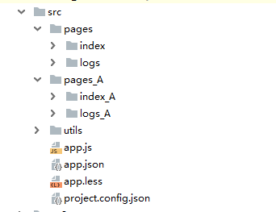

> 参考文献：
- [wxapp-webpack-plugin](https://github.com/Cap32/wxapp-webpack-plugin/blob/master/src/index.js)
- [小程序官网](https://developers.weixin.qq.com/miniprogram/dev/)
- 

# 示例项目结构:



# 转换结果:

> 第一步：
````
- src
  - pages
    - index
    - logs
  - pages_A
    - index_A
    - logs_A
  app.js
  app.json
  app.less
  project.config.json
  common.js // 默认所有chunk > 1 的js
````
> 第二步：
````
- src
  - pages
    - index
    - logs
    common.js // pages下所有chunk > 1 的js
  - pages_A
    - index_A
    - logs_A
    common.js // pages_A下所有chunk > 1 的js
  app.js
  app.json
  app.less
  project.config.json
  common.js // 默认所有chunk > 1 的js
````